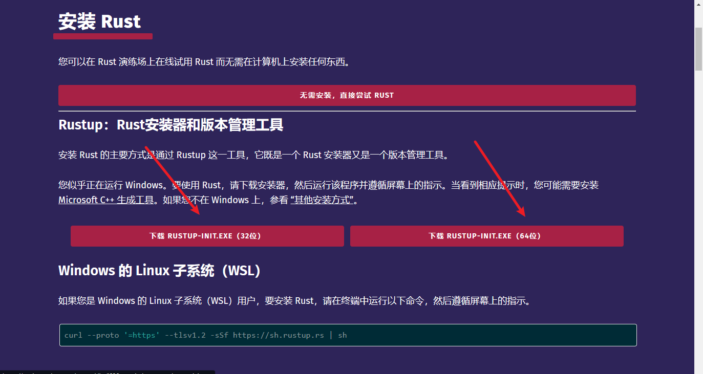
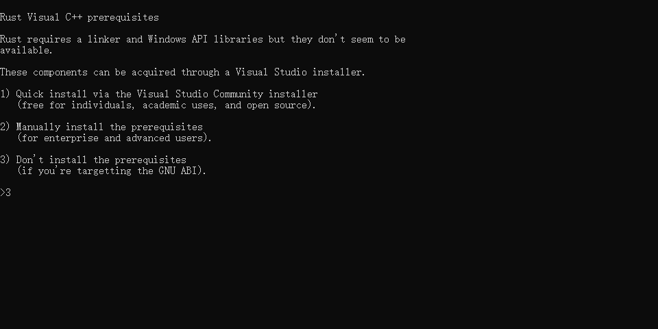
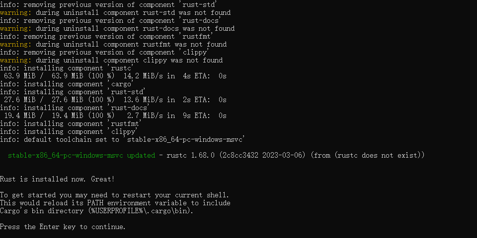
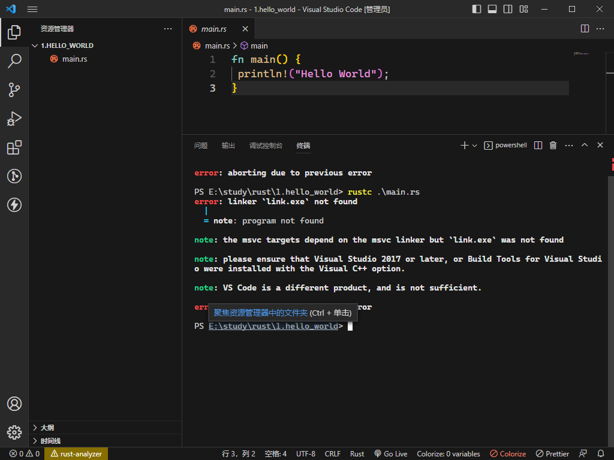
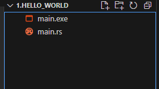

# rust的配置环境搭建

## 基本环境搭建
- 去官网下载rust安装包 [Rust下载](https://www.rust-lang.org/zh-CN/learn/get-started "rust安装包下载地址")
 按照自己的系统选择下面的安装包


然后出现命令行,我们先选3 不然会占c盘很多空间

后面的直接yes，他会安装必须的rust包

下面这个就表示你已经完成了



这时候我们打开vscode 新建一个main.rs文件 并且在命令行下运行rustc .\main.rs

**就会报错**

问题是我们还有一些依赖没有装，所以我们装一下（命令行）
```
rustup toolchain install stable-x86_64-pc-windows-gnu
rustup default stable-x86_64-pc-windows-gnu
```
安装完成后我们再试一次 `rustc .\main.rs` 发现会多一个同名的二进制文件 这表示编译成功了



## 切换国内的镜像   
- 首先我们先找到规定路径 `C:\Users\(你的电脑用户名)\.cargo`
- 新建一个文件 `config`**(！注意不需要扩展名)**
- 直接复制进入就可以了 一个源不行 可以换其他的
```
# 放到 `config` 文件中
[source.crates-io]
registry = "https://github.com/rust-lang/crates.io-index"

# 替换的镜像源
replace-with = 'ustc' 

# 清华大学
[source.tuna]
registry = "https://mirrors.tuna.tsinghua.edu.cn/git/crates.io-index.git"

# 中国科学技术大学
[source.ustc]
registry = "git://mirrors.ustc.edu.cn/crates.io-index"

# 上海交通大学
[source.sjtu]
registry = "https://mirrors.sjtug.sjtu.edu.cn/git/crates.io-index"

# rustcc 1号源
[source.rustcc]
registry="git://crates.rustcc.com/crates.io-index"

# rustcc 2号源
[source.rustcc2]
registry="git://crates.rustcc.cn/crates.io-index"
```