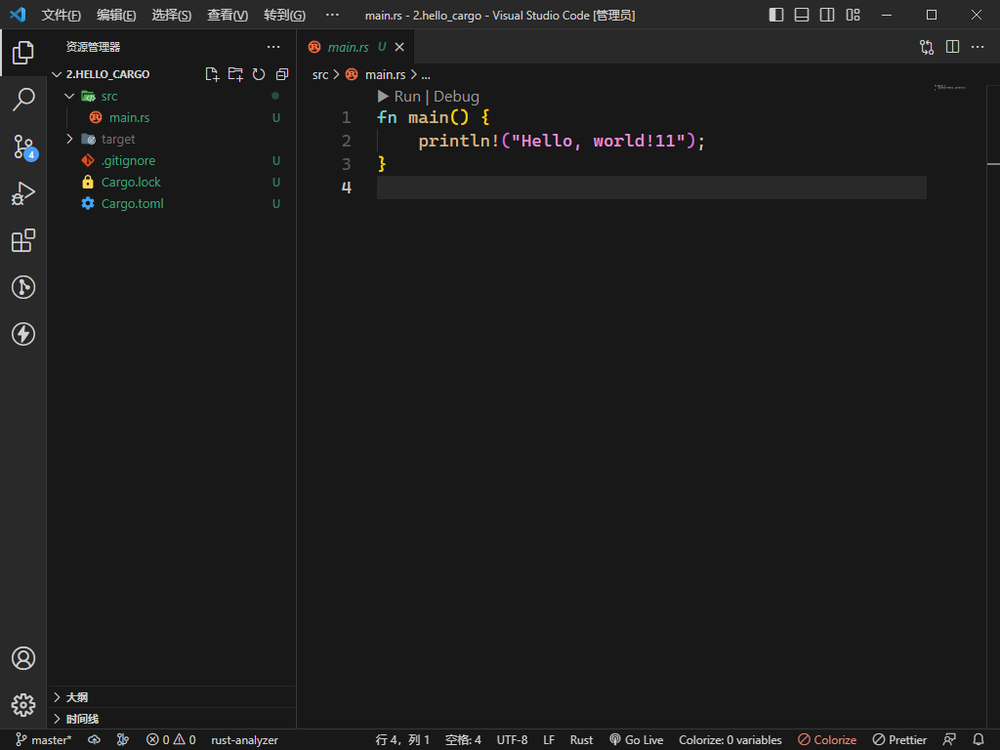

# Cargo 
## Cargo创建rust项目

``` 
cargo new (项目名)
```
**就可以创建一个rust项目了**  
`默认有以下文件`


- 文件名：Cargo.toml  
  * 这个文件使用 TOML (Tom's Obvious, Minimal Language) 格式，这是 Cargo 配置文件的格式。
- 文件名：src/main.rs
  * Cargo 为你生成了一个 “Hello, world!” 程序

## cargo 基本命令
```
# 打包项目 产生可执行文件
cargo build 
# 运行项目
cargo run 
# 快速检查代码确保其可以编译，但并不产生可执行文件：
cargo check
```
如果一切顺利，终端上应该会打印出 Hello, world!。首次运行 cargo build 时，也会使 Cargo 在项目根目录创建一个新文件：Cargo.lock。这个文件记录项目依赖的实际版本。这个项目并没有依赖，所以其内容比较少。你自己永远也不需要碰这个文件，让 Cargo 处理它就行了。
## 猜数字游戏
  创建一个新项目
``` 
cargo new guessing_game
cd guessing_game
cd .
```
### 处理一次猜测
我们在main.rs里添加以下内容
```rust
// 为了获取用户输入并打印结果作为输出，
//我们需要将 io输入/输出库引入当前作用域。io 库来自于标准库，也被称为 std：
use std::io;

fn main() {
    //默认打印命令（换行）
    println!("Guess the number!");

    println!("Please input your guess.");

    //let 表示创建一个变量 mut 表示这个变量是可变的
    // rust 默认变量是不可变的  
    // let apples = 5; // 不可变 
    // let mut bananas = 5; // 可变 
    // String::new表示会创建一个String 空实例
    // String::new 可以理解魏 String 是一个类 new 是一个静态方法 
    // String.new这样的形势
    let mut guess = String::new();

    
    io::stdin()
        .read_line(&mut guess)
        .expect("Failed to read line");

    println!("You guessed: {guess}");
}

```
`详情请看`[rust中文学习网](https://kaisery.github.io/trpl-zh-cn/ch02-00-guessing-game-tutorial.html#%E4%BD%BF%E7%94%A8-result-%E7%B1%BB%E5%9E%8B%E6%9D%A5%E5%A4%84%E7%90%86%E6%BD%9C%E5%9C%A8%E7%9A%84%E9%94%99%E8%AF%AF)